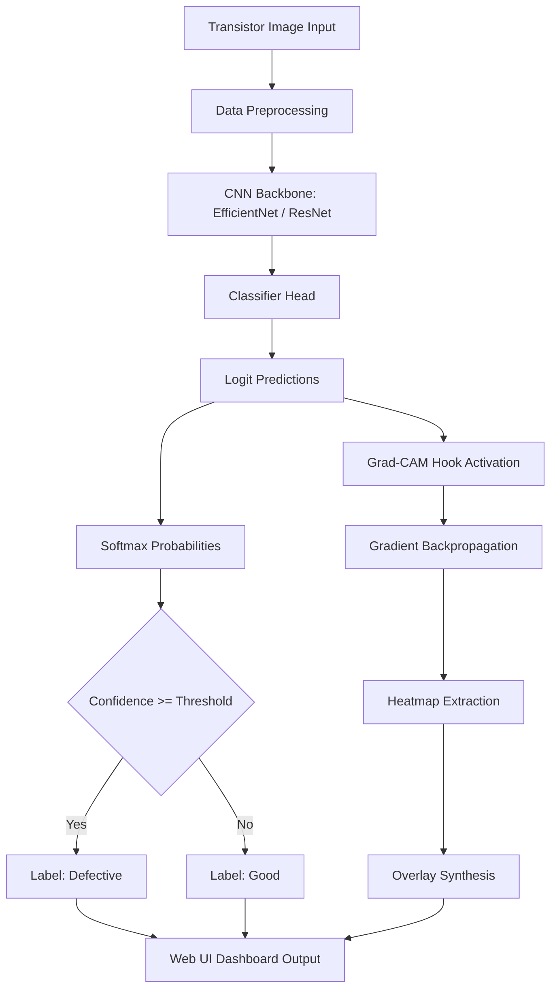

# 🔬 System Pipeline & Architecture

This document describes the end-to-end design, data pipelines, model configurations, and explainable AI hooks utilized in the **Transistor Defect Detector** system.

---

## 1. Architectural Blueprint

The application follows a standard modular deep learning architecture with an integrated REST API backend and interactive user interface.

---

## 2. Component Pipeline Breakdowns

### Preprocessing & Data Augmentation
- Raw input image channels are read, and the image is resized to `256×256` then center-cropped to `224×224` to match standard backbone input expectations.
- Tensors are normalized using standard ImageNet mean `[0.485, 0.456, 0.406]` and standard deviation `[0.229, 0.224, 0.225]`.
- For training, random augmentations are introduced (flips, 15° rotation, random resized crops, and color jitter) to make the model robust to subtle lighting offsets and layout rotation variations.

### Backbone Architecture Selection
The system natively supports two state-of-the-art CNN feature extractors:
1. **EfficientNet-B0**: Extremely lightweight and efficient. Perfect for standard CPU deployment tiers on free cloud platforms (like Hugging Face Spaces).
2. **ResNet-50**: Deep residual network utilizing bottleneck blocks. Captures complex spatial structures but requires significantly larger memory footprint during training and inference.

---

## 3. Explainability (Grad-CAM Integration)

Without explainability, binary classification models acts as a "black box" in critical manufacturing quality checks. We integrate **Grad-CAM** to establish operator confidence.

### The Algorithm
- During the forward pass, feature maps are computed at the targeted layer (typically the last convolutional block).
- During the backward pass, gradients are computed with respect to the output score of the target class.
- The gradients are globally averaged pooled to compute a weight $a_k$ representing the importance of each feature map.
- A weighted sum of the feature maps is computed, followed by a ReLU activation to only focus on features that positively contribute to the target class:

$$L_{Grad-CAM}^c = ReLU\left(\sum_k a_k^c A^k\right)$$

- The resulting heatmap is resized to $224\times224$, colorized with a JET colormap, and alpha-blended with the original image for frontend rendering.
